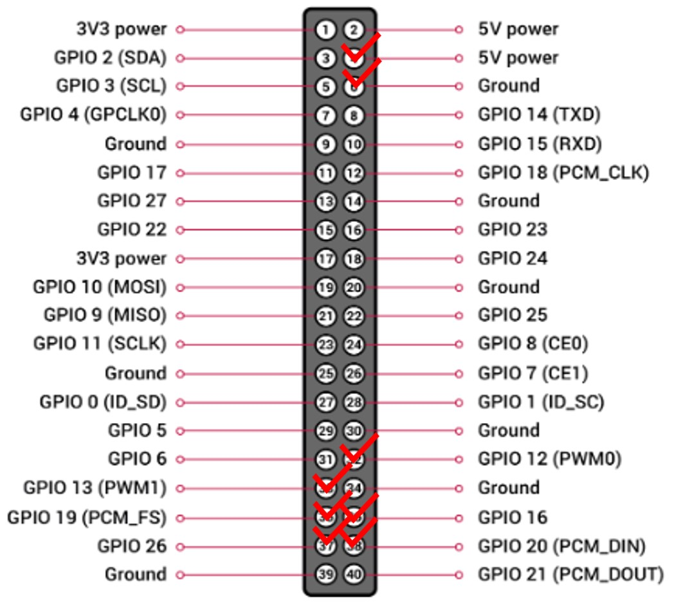

# Graduation Project
<div align="center"></div>
<div align="center"></div>

## Introduction
My graduation project is a laser-based potato sprout remover machine.

### How it works?
* Place a camera that shoot straight down a potato's sprout on top of the plate. 
* Creates an imaginary circle that surrounds on it. Once imaginary circle is created, use its radius value to determine the total distance we need to move the laser. 
* Once the laser on the rod is at the specified location, turn on the laser and rotate the plate to begin cutting the sprout.

## Materials Used
* Jetson Nano 4GB
* 720p Camera
* Toy Laser
* 3V Motors (3x)
* AA Battery (10x)
* L298N Module
* M6 Nut (2x)
* M6 Bolt 150mm (2x)
* Cardboard
* Line Wires

## Algorithm
### Radius
<p align="center" width="100%">
     
     
     
</p>
We want to extract the sprout from the picture and determine circle's radius that encloses the whole sprout. We are able to do this by using canny edge technique and calculate the furthest pixel among four directions (right,left,up,down) starting from the center.

### Rod
<div align="center"></div>
<br/>
<div align="center"></div>  
Once we get the radius value, we insert it to an equation to determine h3's final height.
<br/>

#### Pre-determined settings:
- [ ] h1 = 12.4cm
- [ ] h2 = 7cm (potato's height) + 5.3cm = 12.3cm
- [ ] D = 12.6cm
- [ ] d = 7.8cm
- [ ] h3's initial height is identical to h1  

## Motor Operation with Jetson Nano's GPIO
### L298N Module Layout
<p align="center">
  </p>
 
L298N is capable of driving two DC motors. It has a supply range of 5V to 35V and is capable of 2A continuous current per channel.  
Moreover, the speed of a DC motor can be controlled by changing its input voltage. Thus, it is using a PWM to control the speed. 
To enable PWM for both motors, you will need to remove the jumper of MA and MB in the layout I provided to you.

**Warning!!**
L298N is able to receive more voltage up to 35V. However, we **MUST** remove the 5V regulator jumper in order to work! Otherwise, it could damage to the board!
If the motor power supply is less than 12V, you can keep the jumper in place.
Remember that when jumper is removed, the regulator is also disabled, thus we have to supply 5V seperately to the +5V pin. On the other hand, putting the jumper in place, 5V pin acts as the output pin, thus you can power an another board such as Arduino.

### GPIO (General Purpose Input/Output)
<div align="center"></div>
</br>
Jetson Nano has total of 40 pins and each pin has their own purpose. These pins are similar to the Rasberry PI, however, Jetson Nano only has 2 pins that has PWM capabilities. The pins we used are 4,5,32,33,35,36,37, and 38. 4,5 pins are used to supply power to L298N board, 33,35,37 pins are used to control 1st motor, the rest are used for controlling 2nd motor. To actually run the motor, we need to make sure to import RPi.GPIO as GPIO in the beginning of the code.

## Accuracy & TensorRT
<div align="center"></div>
<div align="center">AP: 0.75 at 300 Epochs</div>

### Modified Pre-Trained YOLOX-Nano Model
Model |size |mAP<sup>val<br>0.5:0.95 | Params<br>(M) |FLOPs<br>(G)| weights |
| ------        |:---:  |  :---:       |:---:     |:---:  | :---: |
|[YOLOX-Nano](./exps/example/yolox_voc/yolox_voc_s.py) |640  |41.0  |2.24M |6.93 |[latest_ckpt.pth](./latest_ckpt.pth) |

* Trained 600 Pictures (7 Train : 3 Test) with batch size of 32 and FP16 using Google Colab  
* Non TensorRT's Inference Time: 0.085s (FPS: ~5)  
* TensorRT's Inference Time: 0.042s (FPS: ~10)  
* With TensorRT, it is **2.02x faster!** 

### Example Outputs
<p align="center" width="100%">
     
     
     
</p>
    
## Codes
<details>
<summary>Radius</summary>
    
```shell
#!/usr/bin/env python3
import numpy as np
import cv2 as cv
def radius(frame):
    image = frame
    image = cv.cvtColor(image, cv.COLOR_BGR2RGB)
    for i in range(480):
        for j in range(640):
                if int(image[i,j,0])>41 and int(image[i,j,1])>45 and int(image[i,j,2])>14:
                    image[i,j,0] = 200; image[i,j,1] = 200; image[i,j,2] = 200

    # convert image to canny
    edges = cv.Canny(image, 30, 100)
    edges = np.array(edges)

    # crop image to 100-100
    image = edges[190:290, 270:370]

    a, b, c, d = [0, 0], [0, 0], [0, 0], [0, 0]

    # algorithm for finding radius 1
    for j in range(83):
        if j>14:
            for i in range(83):        
                if image[i,j] == 255:
                    a = [i,j]  
                    break
                else:
                    continue            
            if a!=[0,0]:
                break
            else:
                continue
        else:
            continue


    for j in range(83):
        if j>12:
            for i in range(83):        
                if image[i,82-j] == 255:
                    c = [i,82-j]  
                    break
                else:
                    continue            
            if c!=[0,0]:
                break
            else:
                continue
        else:
            continue


    for i in range(83):
        if i>25:
            for j in range(83):       
                if image[i,j] == 255:
                    d = [i,j]  
                    break
                else:
                    continue            
            if d!=[0,0]:
                break
            else:
                continue
        else:
            continue

    for i in range(83):
        for j in range(83):
        
            if image[82-i,j] == 255:
                b = [82-i,j]  
                break
            else:
                continue            
        if b!=[0,0]:
            break
        else:
            continue
    
    O = [(b[0] + d[0])/2, (a[1] + c[1]) / 2]
    distance = []
    distance.append(np.sqrt((a[0] - O[0]) ** 2 + (a[1] - O[1]) ** 2))
    distance.append(np.sqrt((b[0] - O[0]) ** 2 + (b[1] - O[1]) ** 2))
    distance.append(np.sqrt((c[0] - O[0]) ** 2 + (c[1] - O[1]) ** 2))
    distance.append(np.sqrt((d[0] - O[0]) ** 2 + (d[1] - O[1]) ** 2))

    # setting up appropriate radius
    R = 0.94*max(distance)+abs((max(O)-50)/8)
    return 
```                       
</details>
    
<details>
<summary>Rod</summary>
    
```shell 
#!/usr/bin/env python3
def h3_height(x):
    if x == 50:
        R = 2
    else:
        x = round(x,1)
        R = (2*x)/50 
    
    h1 = 19.8
    h2 = 5.3 + 5.4
    d = 7.8
    D = 12.6

    full_h3 = h1 + ((h1-h2)*d/(D-R))
    h3 = round(full_h3 - 7.4, 1)
    
    return h3
```                       
</details>
    
<details>
<summary>Main</summary>

```shell 
#!/usr/bin/env python3
import argparse
import os
import time
from loguru import logger
import ast
import cv2
import torch
#******************************************************************************#
from radius import *
from main import *
#******************************************************************************#
from yolox.data.data_augment import ValTransform
from yolox.data.datasets import COCO_CLASSES
from yolox.exp import get_exp
from yolox.utils import fuse_model, get_model_info, postprocess, vis
#*******************************************************************************#
# motor attributes
import RPi.GPIO as GPIO
import time
GPIO.setwarnings(False)

# 막대(PWM)
ENA = 33
IN1 = 35
IN2 = 37

# 플레이트 Motor on Pins (PWM)
ENB = 32
IN3 = 36
IN4 = 38

# set pin numbers to the board's
GPIO.setmode(GPIO.BOARD)
GPIO.setup([ENA,ENB,IN1,IN2,IN3,IN4], GPIO.OUT, initial=GPIO.LOW)
p1 = GPIO.PWM(ENA, 100) #막대
p2 = GPIO.PWM(ENB, 100) #플레이트

def plate():
    GPIO.output(IN3, GPIO.HIGH)
    GPIO.output(IN4, GPIO.LOW)

def rod_up():
    GPIO.output(IN2, GPIO.LOW)
    GPIO.output(IN1, GPIO.HIGH) 

def rod_down():
    GPIO.output(IN2, GPIO.HIGH)
    GPIO.output(IN1, GPIO.LOW)

def rod(x):
    distancetoMove = x - 12.4
    time = distancetoMove / 0.6 # 0.6cm/s
    time = round(time,1)
    time = time-1.5
    return time
#*******************************************************************************#

IMAGE_EXT = [".jpg", ".jpeg", ".webp", ".bmp", ".png"]

def make_parser():
    parser = argparse.ArgumentParser("YOLOX Demo!")
    parser.add_argument(
        "demo", default="image", help="demo type, eg. image, video and webcam"
    )
    parser.add_argument("-expn", "--experiment-name", type=str, default=None)
    parser.add_argument("-n", "--name", type=str, default=None, help="model name")

    parser.add_argument(
        "--path", default="./assets/dog.jpg", help="path to images or video"
    )
    parser.add_argument("--camid", type=int, default=0, help="webcam demo camera id")
    parser.add_argument(
        "--save_result",
        action="store_true",
        help="whether to save the inference result of image/video",
    )

    # exp file
    parser.add_argument(
        "-f",
        "--exp_file",
        default=None,
        type=str,
        help="please input your experiment description file",
    )
    parser.add_argument("-c", "--ckpt", default=None, type=str, help="ckpt for eval")
    parser.add_argument(
        "--device",
        default="cpu",
        type=str,
        help="device to run our model, can either be cpu or gpu",
    )
    parser.add_argument("--conf", default=0.3, type=float, help="test conf")
    parser.add_argument("--nms", default=0.3, type=float, help="test nms threshold")
    parser.add_argument("--tsize", default=None, type=int, help="test img size")
    parser.add_argument(
        "--fp16",
        dest="fp16",
        default=False,
        action="store_true",
        help="Adopting mix precision evaluating.",
    )
    parser.add_argument(
        "--legacy",
        dest="legacy",
        default=False,
        action="store_true",
        help="To be compatible with older versions",
    )
    parser.add_argument(
        "--fuse",
        dest="fuse",
        default=False,
        action="store_true",
        help="Fuse conv and bn for testing.",
    )
    parser.add_argument(
        "--trt",
        dest="trt",
        default=False,
        action="store_true",
        help="Using TensorRT model for testing.",
    )
    return parser


def get_image_list(path):
    image_names = []
    for maindir, subdir, file_name_list in os.walk(path):
        for filename in file_name_list:
            apath = os.path.join(maindir, filename)
            ext = os.path.splitext(apath)[1]
            if ext in IMAGE_EXT:
                image_names.append(apath)
    return image_names


class Predictor(object):
    def __init__(
        self,
        model,
        exp,
        cls_names=COCO_CLASSES,
        trt_file=None,
        decoder=None,
        device="cpu",
        fp16=False,
        legacy=False,
    ):
        self.model = model
        self.cls_names = cls_names
        self.decoder = decoder
        self.num_classes = exp.num_classes
        self.confthre = exp.test_conf
        self.nmsthre = exp.nmsthre
        self.test_size = exp.test_size
        self.device = device
        self.fp16 = fp16
        self.preproc = ValTransform(legacy=legacy)
        if trt_file is not None:
            from torch2trt import TRTModule

            model_trt = TRTModule()
            model_trt.load_state_dict(torch.load(trt_file))

            x = torch.ones(1, 3, exp.test_size[0], exp.test_size[1]).cuda()
            self.model(x)
            self.model = model_trt

    def inference(self, img):
        img_info = {"id": 0}
        if isinstance(img, str):
            img_info["file_name"] = os.path.basename(img)
            img = cv2.imread(img)
        else:
            img_info["file_name"] = None

        height, width = img.shape[:2]
        img_info["height"] = height
        img_info["width"] = width
        img_info["raw_img"] = img

        ratio = min(self.test_size[0] / img.shape[0], self.test_size[1] / img.shape[1])
        img_info["ratio"] = ratio

        img, _ = self.preproc(img, None, self.test_size)
        img = torch.from_numpy(img).unsqueeze(0)
        img = img.float()
        if self.device == "gpu":
            img = img.cuda()
            if self.fp16:
                img = img.half()  # to FP16

        with torch.no_grad():
            t0 = time.time()
            outputs = self.model(img)
            if self.decoder is not None:
                outputs = self.decoder(outputs, dtype=outputs.type())
            outputs = postprocess(
                outputs, self.num_classes, self.confthre,
                self.nmsthre, class_agnostic=True
            )
            logger.info("Infer time: {:.4f}s".format(time.time() - t0))
        return outputs, img_info

    def visual(self, output, img_info, cls_conf=0.35):
        ratio = img_info["ratio"]
        img = img_info["raw_img"]
        if output is None:
            return img
        output = output.cpu()

        bboxes = output[:, 0:4]

        # preprocessing: resize
        bboxes /= ratio

        cls = output[:, 6]
        scores = output[:, 4] * output[:, 5]

        vis_res = vis(img, bboxes, scores, cls, cls_conf, self.cls_names)
        return vis_res, bboxes


###############################################################################
def image_demo(predictor, vis_folder, path, current_time, save_result):
    if os.path.isdir(path):
        files = get_image_list(path)
    else:
        files = [path]
    files.sort()

    # rectangle attributes
    color = (255,0,0)
    thickness = 2
    count = 0

    # text attributes
    org = (50,50)
    fontScale = 1
    color2 = (255,0,0)
    thickness2 = 2
    font = cv2.FONT_HERSHEY_SIMPLEX

    for image_name in files:
      try:
        outputs, img_info = predictor.inference(image_name)
        result_image, bboxes= predictor.visual(outputs[0], img_info, predictor.confthre)
        if save_result:
            save_folder = os.path.join(
                vis_folder, time.strftime("%Y_%m_%d_%H_%M_%S", current_time)
            )
            os.makedirs(save_folder, exist_ok=True)
            save_file_name = os.path.join(save_folder, os.path.basename(image_name))
            logger.info("Saving detection result in {}".format(save_file_name))
            #logger.info("BBox: {}".format(bboxes.cpu().detach().numpy()))
            rectangles = bboxes.cpu().detach().numpy()

            # rectangle attributes 2
            pic = cv2.imread(image_name)
            width, height = pic.shape[:2]
            aa = int((height/2) - 150)
            bb = int((width/2) - 150)
            cc = int(aa + 300)
            dd = int(bb + 300)
            #logger.info("[Blue Rectangle] Start: ({},{}), End: ({},{})".format(aa,bb,cc,dd))
            
            start_point = (aa,bb)
            end_point = (cc,dd)
            
            # laser power 
            for a,b,c,d in rectangles[:]:
              if a > start_point[0] and b > start_point[1] and c < end_point[0] and d < end_point[1]:
                count +=1
                length = int(c-a)
                height = int(d-b)
                area = length * height
                if area >= 50000:
                  txt = "4"
                elif area >= 30000:
                  txt = "3"
                elif area >= 12000:
                  txt = "2"
                elif area >= 1:
                  txt = "1"
                else: 
                  txt = "-"
                
             # cutable 
            if count == 1:
              txt2 = "YES!"
            elif count >= 2:
              txt2 = "NO!"
              txt = "-"
            else:
              txt2 = "NO!"
              txt = "-"
    
            result_image = cv2.rectangle(result_image, start_point, end_point, color, thickness)
            result_image = cv2.putText(result_image, 'Can you cut it?: {}'.format(txt2), org, font, fontScale, color2, thickness2, cv2.LINE_AA)
            result_image = cv2.putText(result_image, 'Count: {}'.format(count), (50,100), font, fontScale, color2, thickness2, cv2.LINE_AA)
            result_image = cv2.putText(result_image, 'Laser Power: {}'.format(txt), (50,150), font, fontScale, color2, thickness2, cv2.LINE_AA)
            cv2.imwrite(save_file_name, result_image)

      # if no bboxes are detected
      except: 
        outputs, img_info = predictor.inference(image_name)
        result_image = predictor.visual(outputs[0], img_info, predictor.confthre)
        if save_result:
            save_folder = os.path.join(
                vis_folder, time.strftime("%Y_%m_%d_%H_%M_%S", current_time)
            )
            os.makedirs(save_folder, exist_ok=True)
            save_file_name = os.path.join(save_folder, os.path.basename(image_name))
            logger.info("Saving detection result in {}".format(save_file_name))

            # rectangle attributes 2
            pic = cv2.imread(image_name)
            width, height = pic.shape[:2]
            aa = int((height/2) - 150)
            bb = int((width/2) - 150)
            cc = int(aa + 300)
            dd = int(bb + 300)
            logger.info("[Blue Rectangle] Start: ({},{}), End: ({},{})".format(aa,bb,cc,dd))
            
            start_point = (aa,bb)
            end_point = (cc,dd)
        
            result_image = cv2.rectangle(result_image, start_point, end_point, color, thickness)
            result_image = cv2.putText(result_image, 'Can you cut it?: {}'.format("NO!"), org, font, fontScale, color2, thickness2, cv2.LINE_AA)
            result_image = cv2.putText(result_image, 'Count: {}'.format(0), (50,100), font, fontScale, color2, thickness2, cv2.LINE_AA)
            result_image = cv2.putText(result_image, 'Laser Power: {}'.format("-"), (50,150), font, fontScale, color2, thickness2, cv2.LINE_AA)
            cv2.imwrite(save_file_name, result_image)
        
        ch = cv2.waitKey(0)
        if ch == 27 or ch == ord("q") or ch == ord("Q"):
            break
        
        
def convert_laser_power(y): # y = area
        if y >= 50000:
            laser = 4
        elif y >= 30000:
            laser = 3
        elif y >= 12000:
            laser = 2
        elif y >= 1:
             laser = 1
        return laser

id_num = []
def bbox_comparison(x,y,tmp,z): # x = area, y = area list # e = id list # z = coordinate list
    if x not in y: # if area is in the list, we skip to "else"
      if tmp in z: 
        y.append(x)
        area_list_count = len(y)
        id_num.append(area_list_count)
    else:
        area_list_count = len(y)
        id_num.append(area_list_count)
    return y, id_num, z


R_list = []
def mouse_click(event,x,y,flags,params):
    layer1  = params[0] # overlay
    layer2  = params[1] # result_frame
    image   = params[2] # frame

    if event == cv2.EVENT_LBUTTONDOWN: # layer1 = overlay= result_frame with bboxes, layer2 = text id and click to radius + transparentcy
        cv2.rectangle(layer1, (0,0), (640,480), (255, 255, 255), 1)
        cv2.addWeighted(layer1, 0.2, layer2, 0.2, 0, layer2)
        layer3 = layer2.copy()
        cv2.putText(layer2, "Please Wait!", (220, 240), cv.FONT_HERSHEY_SIMPLEX, 1, (255, 255, 255), 2, cv2.LINE_AA)
        cv2.putText(layer2, "Calculating Radius..", (170, 270), cv.FONT_HERSHEY_SIMPLEX, 1, (255, 255, 255), 2, cv2.LINE_AA)
        cv2.imshow("Graduation Project - JQ, YJ", layer2)
        cv2.waitKey(0)
        while True:
            R = radius(image)
            cv2.putText(layer3, "Radius is {}".format(round(R,1)), (220, 240), cv.FONT_HERSHEY_SIMPLEX, 1, (255, 255, 255), 2, cv2.LINE_AA)
            cv2.putText(layer3, "Press 'W' to Return!", (170, 270), cv.FONT_HERSHEY_SIMPLEX, 1, (255, 255, 255), 2, cv2.LINE_AA)
            cv2.imshow("Graduation Project - JQ, YJ", layer3)
            logger.info("Radius is {}".format(round(R,1)))
            R_list.append(R)
            break

        k = cv2.waitKey(1)
        if k == ord("w") or k == ord("W"):
            cv2.imshow("Graduation Project - JQ, YJ", result_frame) 

def mouse_click2(event,x,y,flags,params):
    layer1  = params[0] # overlay
    layer2  = params[1] # result_frame
    h3_time = params[2] # h3_time

    if event == cv2.EVENT_MBUTTONDOWN:
        cv2.rectangle(layer1, (0,0), (640,480), (255, 255, 255), 1)
        a = cv2.addWeighted(layer1, 0.2, layer2, 0.2, 0, layer2)
        layer3 = a.copy()
        layer4 = a.copy()
        layer5 = a.copy()
        cv2.putText(layer3, "Please Wait!", (220, 240), cv.FONT_HERSHEY_SIMPLEX, 1, (255, 255, 255), 2, cv2.LINE_AA)
        cv2.putText(layer3, "Processing..", (220, 270), cv.FONT_HERSHEY_SIMPLEX, 1, (255, 255, 255), 2, cv2.LINE_AA)
        cv2.imshow("Graduation Project - JQ, YJ", layer3)
        cv2.waitKey(1)

        # rod move
        rod_up()
        p1.start(40)
        time.sleep(h3_time)
        logger.info("Time Duration for Rod: {}".format(h3_time))
        p1.stop()

        # plate move
        plate()
        p2.start(20)
        time.sleep(3)
        p2.stop()

        while True:
            cv2.putText(a, "Completed!", (220, 240), cv.FONT_HERSHEY_SIMPLEX, 1, (255, 255, 255), 2, cv2.LINE_AA)
            cv2.putText(a, "Please Remove the Potato and then Press 'W' Afterwards!", (40, 270), cv.FONT_HERSHEY_SIMPLEX, 0.6, (255, 255, 255), 2, cv2.LINE_AA)
            cv2.imshow("Graduation Project - JQ, YJ", a)
            cv2.waitKey(0)

            cv2.putText(layer4, "Initializing Program...", (150, 270), cv.FONT_HERSHEY_SIMPLEX, 1, (255, 255, 255), 2, cv2.LINE_AA)
            cv2.imshow("Graduation Project - JQ, YJ", layer4)
            cv2.waitKey(1)

            rod_up()
            p1.start(40)
            time.sleep(5)
            p1.stop()

            rod_down()
            p1.start(40)
            time.sleep(10.5)
            p1.stop()

            cv2.putText(layer5, "Press 'W' to Proceed!", (150, 240), cv.FONT_HERSHEY_SIMPLEX, 1, (255, 255, 255), 2, cv2.LINE_AA)
            cv2.imshow("Graduation Project - JQ, YJ", layer5)
            break
            
        k = cv2.waitKey(1)
        if k == ord("w") or k == ord("W"):
            cv2.imshow("Graduation Project - JQ, YJ", result_frame)
          
def imageflow_demo(predictor, vis_folder, current_time, args):
    cap = cv2.VideoCapture(args.path if args.demo == "video" else args.camid)
    width = cap.get(cv2.CAP_PROP_FRAME_WIDTH)  # float
    height = cap.get(cv2.CAP_PROP_FRAME_HEIGHT)  # float
    fps = cap.get(cv2.CAP_PROP_FPS)

    # boolean attribute
    boolean = False

    # FPS attributes 1
    fps2_start_time = 0
    fps2 = 0

    # rectangle attributes
    color = (255,0,0)
    thickness = 2
    count = 0

    # text attributes
    fontScale = 0.7
    color2 = (255,0,0) # blue color
    thickness2 = 2
    font = cv2.FONT_HERSHEY_SIMPLEX

    if args.save_result:
        save_folder = os.path.join(
            vis_folder, time.strftime("%Y_%m_%d_%H_%M_%S", current_time)
        )
        os.makedirs(save_folder, exist_ok=True)
        if args.demo == "video":
            save_path = os.path.join(save_folder, os.path.basename(args.path))
        else:
            save_path = os.path.join(save_folder, "camera.mp4")
        logger.info(f"video save_path is {save_path}")
        vid_writer = cv2.VideoWriter(
            save_path, cv2.VideoWriter_fourcc(*"mp4v"), fps, (int(width), int(height))
        )
    
    #Demo Resolution: 640x480
    while True:
        ret_val, frame = cap.read()
        cv.imwrite("frame.jpg",frame)

        # FPS attributes 2
        fps2_end_time = time.time()
        time_diff = fps2_end_time - fps2_start_time
        fps2 = 1/time_diff
        fps2_start_time = fps2_end_time

        if ret_val:
            outputs, img_info = predictor.inference(frame)
            if args.save_result:
                vid_writer.write(result_frame)
            else:
              try:
                result_frame, bboxes = predictor.visual(outputs[0], img_info, predictor.confthre)
                rectangles = bboxes.cpu().detach().numpy()

                start_point = (270,190)
                end_point = (370,290)
                
                # mouse click attributes
                overlay = result_frame.copy()
                overlay2 = result_frame.copy()
                
                # attributes
                area_list = []
                id_area_dic = {}
                coordinate = []
                count = 0
                
                #initial txt
                txt1 = "Not Detected!"
                txt2 = "-"
                txt3 = "-"
                txt4 = "-"
                
                # cutable and laser power 
                for a,b,c,d in rectangles[:]:
                  if a > start_point[0] and b > start_point[1] and c < end_point[0] and d < end_point[1]: 
                      count += 1
                      length = int(c-a)
                      height = int(d-b)
                      area = length * height
                      area_list.append(area)
                      tmp = (a,b)
                      coordinate.append(tmp)
                      if count <=2:
                        y, id_num, z = bbox_comparison(area, area_list, tmp, coordinate)
                        for x in id_num:
                          id_area_dic[x] = y[count-1], (z[count-1])
                      # y = area_list ex) y = [2000,1000], id_num = [1,2], z = [(200,100), (100,100)]

                      if len(y) >= 3:
                          txt1 = "No! More than 3 Sprouts Detected!"
                          txt2 = "-"
                          txt3 = "-"

                      elif len(y) == 1:
                          txt1 = "Yes!"
                          txt2 = "1"
                          txt3 = convert_laser_power(y[0])
                          org = id_area_dic[1][1]
                          ff = list(org)
                          ff[1] = ff[1] - 3
                          org1 = tuple(ff)
                          h = org1[0]
                          j = org1[1]

                          img_file =  "frame.jpg"
                          image = cv2.imread(img_file)

                          cv2.rectangle(overlay2,(0,420), (640,480), (255, 255, 255), 1)
                          result_frame = cv2.addWeighted(overlay2, 0.2, result_frame, 0.2, 0, result_frame)
                          copy_result_frame = result_frame.copy()
                        
                          if boolean == False:
                            cv2.putText(result_frame, "Left Click to Calculate Radius", (140, 455), cv.FONT_HERSHEY_SIMPLEX, 0.8, (255, 255, 255), 2, cv2.LINE_AA)
                            cv2.putText(result_frame, 'ID: {}'.format(txt2), (int(h), int(j)), font, 0.4, (0,255,0),thickness2, cv2.LINE_AA)
                            result_frame3 = result_frame
                            cv2.setMouseCallback("Graduation Project - JQ, YJ", mouse_click, [overlay, result_frame, image])

                            if len(R_list) != 0:
                                txt4 = h3_height(R_list[0])
                                boolean = True

                          elif boolean == True:
                            result_frame = cv2.putText(copy_result_frame, "Middle Click to Cut the Sprout", (140, 455), cv.FONT_HERSHEY_SIMPLEX, 0.8, (255, 255, 255), 2, cv2.LINE_AA)
                            cv2.putText(result_frame, 'id: {}'.format(txt2), (int(h), int(j)), font, 0.4, (0,255,0),thickness2, cv2.LINE_AA)
                            txt4 = h3_height(R_list[0])
                            h3_time = rod(txt4)
                            cv2.setMouseCallback("Graduation Project - JQ, YJ", mouse_click2, [overlay, result_frame, h3_time])

                      elif len(y) == 2:
                          txt1 = "Yes!"
                          txt2 = "1"
                          txt3 = convert_laser_power(y[0])
                          txt5 = "2"

                          org = id_area_dic[1][1]
                          ff = list(org)
                          ff[1] = ff[1] -3
                          ofrg1 = tuple(ff)
                          h = org1[0]
                          j = org1[1]
                          
                          org2 = id_area_dic[2][1]
                          hh = list(org2)
                          hh[1] = hh[1] - 3 
                          org3 = tuple(hh)
                          l = org3[0] 
                          k = org3[1]
                          result_frame = cv2.putText(result_frame, 'id: {}'.format(txt2), (int(h), int(j)), font, 0.4, (0,0,255),thickness2, cv2.LINE_AA)
                          result_frame = cv2.putText(result_frame, 'id: {}'.format(txt5), (int(l), int(k)), font, 0.4, (0,0,255),thickness2, cv2.LINE_AA)
                          
                          ch = cv2.waitKey(1)
                          if ch == ord("k") or ch == ord("K"):
                              txt3 = convert_laser_power(y[1])
                              txt2 = "2"

                if count == 0:
                    R_list.clear()
                    boolean = False

                result_frame = cv2.putText(result_frame, "{:1f}".format(fps2), (590,20), font, fontScale, (0,0,255), thickness2, cv2.LINE_AA) # red color
                result_frame = cv2.rectangle(result_frame, start_point, end_point, color, thickness)
                result_frame = cv2.putText(result_frame, 'Can you cut it?: {}'.format(txt1), (5,20), font, fontScale, color2, thickness2, cv2.LINE_AA)
                result_frame = cv2.putText(result_frame, 'ID: {}'.format(txt2), (5,50), font, fontScale, color2, thickness2, cv2.LINE_AA)
                result_frame = cv2.putText(result_frame, 'Laser Power: {}'.format(txt3), (5, 80), font, fontScale, color2, thickness2, cv2.LINE_AA)
                result_frame = cv2.putText(result_frame, "H3's Height: {}cm".format(txt4), (5, 110), font, fontScale, color2, thickness2, cv2.LINE_AA)
                cv2.namedWindow("Graduation Project - JQ, YJ", cv2.WINDOW_NORMAL)
                cv2.imshow("Graduation Project - JQ, YJ", result_frame)

              except:
                result_frame = predictor.visual(outputs[0], img_info, predictor.confthre)
                
                R_list.clear()
                boolean = False
                start_point = (270,190)
                end_point = (370,290)

                result_frame = cv2.putText(result_frame, "{:1f}".format(fps2), (590,20), font, fontScale, (0,0,255), thickness2, cv2.LINE_AA)
                result_frame = cv2.rectangle(result_frame, start_point, end_point, color, thickness)
                result_frame = cv2.putText(result_frame, 'Can you cut it?: {}'.format("Not Detected"), (5, 20), font,fontScale, color2, thickness2, cv2.LINE_AA)
                result_frame = cv2.putText(result_frame, 'ID: {}'.format("-"), (5, 50), font, fontScale, color2,thickness2, cv2.LINE_AA)
                result_frame = cv2.putText(result_frame, 'Laser Power: {}'.format("-"), (5, 80), font, fontScale,color2, thickness2, cv2.LINE_AA)
                result_frame = cv2.putText(result_frame, "H3's Height: {}cm".format("-"), (5, 110), font, fontScale, color2, thickness2, cv2.LINE_AA)
                cv2.namedWindow("Graduation Project - JQ, YJ", cv2.WINDOW_NORMAL)
                cv2.imshow("Graduation Project - JQ, YJ", result_frame)

            ch = cv2.waitKey(1)
            if ch == 27 or ch == ord("q") or ch == ord("Q"):
                GPIO.cleanup()
                break
        else:
            GPIO.cleanup()
            break

#****************************************************************************************************************************************************************************#
def main(exp, args):
    if not args.experiment_name:
        args.experiment_name = exp.exp_name

    file_name = os.path.join(exp.output_dir, args.experiment_name)
    os.makedirs(file_name, exist_ok=True)

    vis_folder = None
    if args.save_result:
        vis_folder = os.path.join(file_name, "vis_res")
        os.makedirs(vis_folder, exist_ok=True)

    if args.trt:
        args.device = "gpu"

    logger.info("Args: {}".format(args))

    if args.conf is not None:
        exp.test_conf = args.conf
    if args.nms is not None:
        exp.nmsthre = args.nms
    if args.tsize is not None:
        exp.test_size = (args.tsize, args.tsize)

    model = exp.get_model()
    logger.info("Model Summary: {}".format(get_model_info(model, exp.test_size)))

    if args.device == "gpu":
        model.cuda()
        if args.fp16:
            model.half()  # to FP16
    model.eval()

    if not args.trt:
        if args.ckpt is None:
            ckpt_file = os.path.join(file_name, "best_ckpt.pth")
        else:
            ckpt_file = args.ckpt
        logger.info("loading checkpoint")
        ckpt = torch.load(ckpt_file, map_location="cpu")
        # load the model state dict
        model.load_state_dict(ckpt["model"])
        logger.info("loaded checkpoint done.")

    if args.fuse:
        logger.info("\tFusing model...")
        model = fuse_model(model)

    if args.trt:
        assert not args.fuse, "TensorRT model is not support model fusing!"
        trt_file = os.path.join(file_name, "model_trt.pth")
        assert os.path.exists(
            trt_file
        ), "TensorRT model is not found!\n Run python3 tools/trt.py first!"
        model.head.decode_in_inference = False
        decoder = model.head.decode_outputs
        logger.info("Using TensorRT to inference")
    else:
        trt_file = None
        decoder = None

    predictor = Predictor(
        model, exp, COCO_CLASSES, trt_file, decoder,
        args.device, args.fp16, args.legacy,
    )
    current_time = time.localtime()
    if args.demo == "image":
        image_demo(predictor, vis_folder, args.path, current_time, args.save_result)
    elif args.demo == "video" or args.demo == "webcam":
        imageflow_demo(predictor, vis_folder, current_time, args)


if __name__ == "__main__":
    args = make_parser().parse_args()
    exp = get_exp(args.exp_file, args.name)

    main(exp, args)
```
</details>
                         
## Files Added/Modified
### Added:
* plate.py (testing purpose only)
* rod.py (testing purpose only)
* latest_ckpt.pth
* main.py
* final.py
* radius.py
* train_log.txt
* YOLOX Linux Commands.txt
### Modified:
* voc.py
* voc_classes.py
* coco_classes.py
* voc_eval.py
* yolox_voc_s.py
