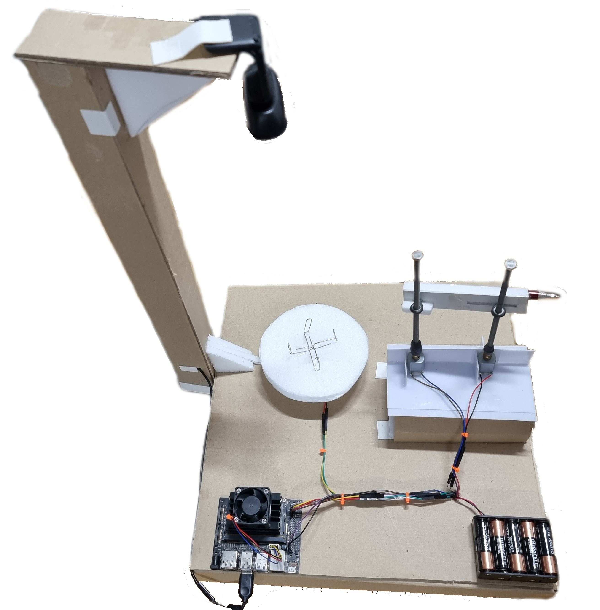
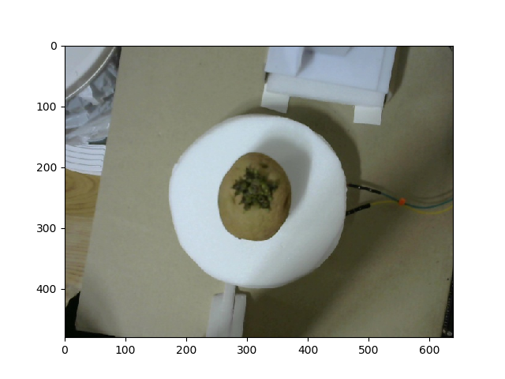
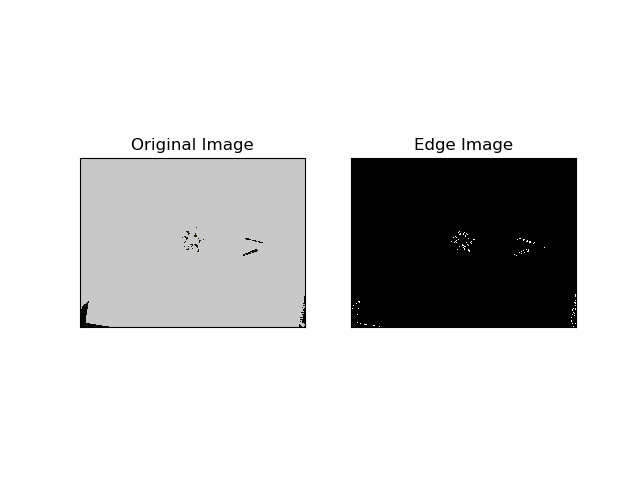
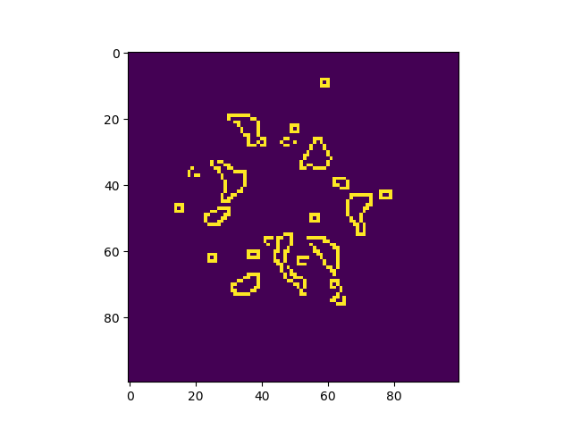
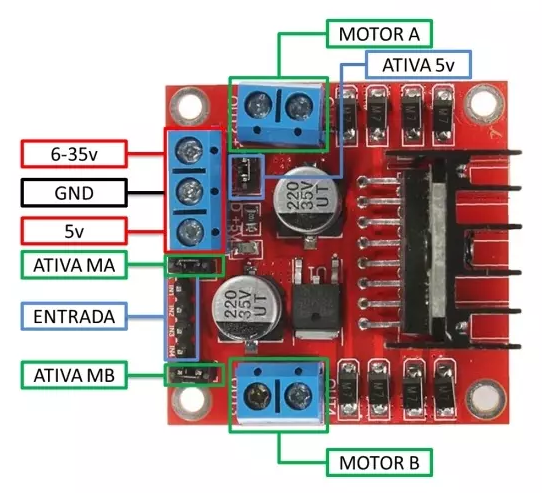
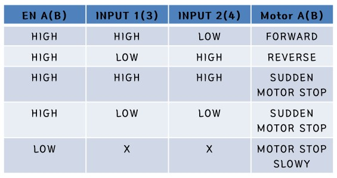
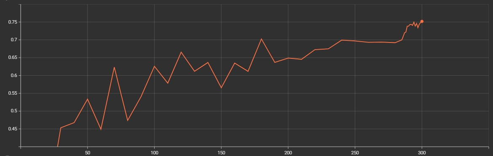
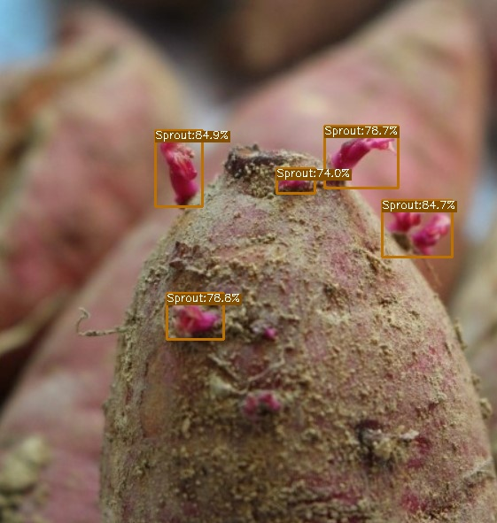
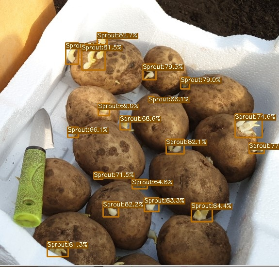
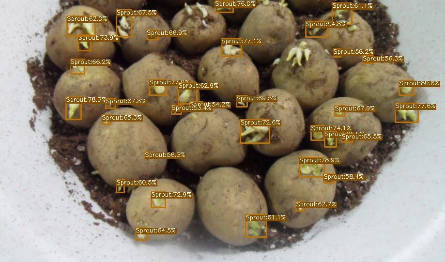

# Graduation Project
<div align="center"></div>

## Introduction
My graduation project is a laser-based potato sprout remover machine.

### How it works?
* Place a camera that shoot straight down a potato's sprout on top of the plate. 
* Creates an imaginary circle that surrounds on it. Once imaginary circle is created, use its radius value to determine the total distance we need to move the laser. 
* Once the laser on the rod is at the specified location, turn on the laser and rotate the plate to begin cutting the sprout.

## Materials Used
* Jetson Nano 4GB
* 720p Camera
* Toy Laser
* 3V Motors (3x)
* AA Battery (10x)
* L298N Module
* M6 Nut (2x)
* M6 Bolt 150mm (2x)
* Cardboard
* Line Wires

## Algorithm
### Radius
<p align="center" width="100%">
     
     
     
</p>

### Rod
<div align="center"></div>
<br/>
<div align="center"></div>  
Once we get the radius value, we insert it to an equation to determine h3's final height.
<br/>

#### Pre-determined settings:
- [ ] h1 = 12.4cm
- [ ] h2 = 7cm (potato's height) + 5.3cm = 12.3cm
- [ ] D = 12.6cm
- [ ] d = 7.8cm
- [ ] h3's initial height is identical to h1  

## Motor Operation (Jetson Nano's GPIO)
### L298N Module Layout
<p align="center">
 </p>
L298N is capable of driving two DC motors. It has a supply range of 5V to 35V and is capable of 2A continuous current per channel.  
Moreover, the speed of a DC motor can be controlled by changing its input voltage. Thus, it is using a PWM to control the speed. 
To enable PWM for both motors, you will need to remove the jumper of MA and MB in the layout I provided to you. 


**Warning!**  
L298N is able to receive more voltage up to 35V. However, we MUST remove the 5V regulator jumper in order to work! Otherwise, it could brick your module!

## Accuracy & TensorRT
<div align="center"></div>
<div align="center">AP: 0.75 at 300 Epochs</div>

### Modified Pre-Trained YoloX-Nano Model
Model |size |mAP<sup>val<br>0.5:0.95 | Params<br>(M) |FLOPs<br>(G)| weights |
| ------        |:---:  |  :---:       |:---:     |:---:  | :---: |
|[YOLOX-Nano](./exps/example/yolox_voc/yolox_voc_s.py) |640  |41.0  | 2.24M |6.93 | [latest_ckpt.pth](./latest_ckpt.pth) |

* Trained 600 Pictures (7 Train : 3 Test) with batch size of 32 and FP16 using Google Colab  
* Non TensorRT's Inference Time: 0.085s (FPS: ~5)  
* TensorRT's Inference Time: 0.042s (FPS: ~10)  
* With TensorRT, it is **2.02x faster!** 

### Example Outputs
<p align="center" width="100%">
     
     
     
</p>
    
## Codes
<details>
<summary>Radius</summary>
    
```shell
#!/usr/bin/env python3
import numpy as np
import cv2 as cv
def radius(frame):
    image = frame
    image = cv.cvtColor(image, cv.COLOR_BGR2RGB)
    for i in range(480):
        for j in range(640):
                if int(image[i,j,0])>41 and int(image[i,j,1])>45 and int(image[i,j,2])>14:
                    image[i,j,0] = 200; image[i,j,1] = 200; image[i,j,2] = 200

    # convert image to canny
    edges = cv.Canny(image, 30, 100)
    edges = np.array(edges)

    # crop image to 100-100
    image = edges[190:290, 270:370]

    a, b, c, d = [0, 0], [0, 0], [0, 0], [0, 0]

    # algorithm for finding radius 1
    for j in range(83):
        if j>14:
            for i in range(83):        
                if image[i,j] == 255:
                    a = [i,j]  
                    break
                else:
                    continue            
            if a!=[0,0]:
                break
            else:
                continue
        else:
            continue


    for j in range(83):
        if j>12:
            for i in range(83):        
                if image[i,82-j] == 255:
                    c = [i,82-j]  
                    break
                else:
                    continue            
            if c!=[0,0]:
                break
            else:
                continue
        else:
            continue


    for i in range(83):
        if i>25:
            for j in range(83):       
                if image[i,j] == 255:
                    d = [i,j]  
                    break
                else:
                    continue            
            if d!=[0,0]:
                break
            else:
                continue
        else:
            continue

    for i in range(83):
        for j in range(83):
        
            if image[82-i,j] == 255:
                b = [82-i,j]  
                break
            else:
                continue            
        if b!=[0,0]:
            break
        else:
            continue
    
    O = [(b[0] + d[0])/2, (a[1] + c[1]) / 2]
    distance = []
    distance.append(np.sqrt((a[0] - O[0]) ** 2 + (a[1] - O[1]) ** 2))
    distance.append(np.sqrt((b[0] - O[0]) ** 2 + (b[1] - O[1]) ** 2))
    distance.append(np.sqrt((c[0] - O[0]) ** 2 + (c[1] - O[1]) ** 2))
    distance.append(np.sqrt((d[0] - O[0]) ** 2 + (d[1] - O[1]) ** 2))

    # setting up appropriate radius
    R = 0.94*max(distance)+abs((max(O)-50)/8)
    return 
```                       
</details>
    
<details>
<summary>Rod</summary>
    
```shell 
#!/usr/bin/env python3
def h3_height(x):
    if x == 50:
        R = 2
    else:
        x = round(x,1)
        R = (2*x)/50 
    
    h1 = 19.8
    h2 = 5.3 + 5.4
    d = 7.8
    D = 12.6

    full_h3 = h1 + ((h1-h2)*d/(D-R))
    h3 = round(full_h3 - 7.4, 1)
    
    return h3
```                       
</details>
    
<details>
<summary>Main</summary>

```shell 
1. [final.py](./tools/final.py)
```
</details>
                         
## Files Added/Modified
### Added:
* plate.py (testing purpose only)
* rod.py (testing purpose only)
* latest_ckpt.pth
* main.py
* radius.py
* train_log.txt
* YOLOX Linux Commands.txt
### Modified:
* voc.py
* voc_classes.py
* coco_classes.py
* voc_eval.py
* yolox_voc_s
