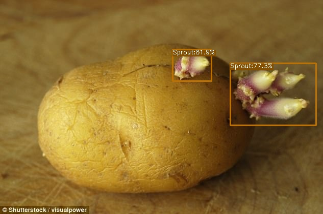

# Graduation Project

     
     
     

## Introduction
My graduation project is a laser-based potato sprout remover machine.

#### How it works?
* Place a camera that shoot straight down a potato's sprout on top of the plate. 
* Creates an imaginary circle that surrounds on it. Once imaginary circle is created, use its radius value to determine the total distance we need to move the laser. 
* Once the laser on the rod is at the specified location, turn on the laser and rotate the plate to begin cutting the sprout.

## Algorithm
#### Imaginary Circle

The files that I modified from the base version or added a new file for this project:
1. plate.py (added)
2. rod.py (added)
3. latest_ckpt.pth (added)
4. main.py (added)
5. radius.py (added)
6. assets and YOLOX outputs folder (added)
8. train_log (detailed).txt (added)
9. frame.jpg (added)
10. YOLOX Linux Commands (added)
11. voc.py (modified)
12. voc_classes.py (modified)
13. coco_classes.py (modified)
14. voc_eval.py (modified)
15. yolox_voc_s (modified)
16. YOLOX Base Version: https://github.com/Megvii-BaseDetection/YOLOX

* will update README soon or later
