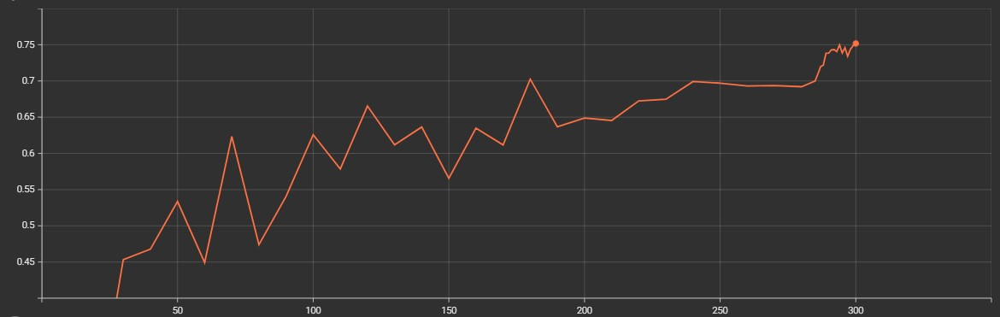

# Graduation Project

## Introduction
My graduation project is a laser-based potato sprout remover machine.

#### How it works?
* Place a camera that shoot straight down a potato's sprout on top of the plate. 
* Creates an imaginary circle that surrounds on it. Once imaginary circle is created, use its radius value to determine the total distance we need to move the laser. 
* Once the laser on the rod is at the specified location, turn on the laser and rotate the plate to begin cutting the sprout.

## Algorithm
#### Imaginary Circle

     
     
     

#### Rod

# Accuracy & TensorRT

**75AP at 300 Epochs**

# Files Added/Modified
### Added:
* plate.py
* rod.py
* latest_ckpt.pth
* main.py
* radius.py
* train_log.txt
* YOLOX Linux Commands.txt
### Modified:
* voc.py
* voc_classes.py
* coco_classes.py
* voc_eval.py
* yolox_voc_s

YOLOX Base Version: https://github.com/Megvii-BaseDetection/YOLOX
